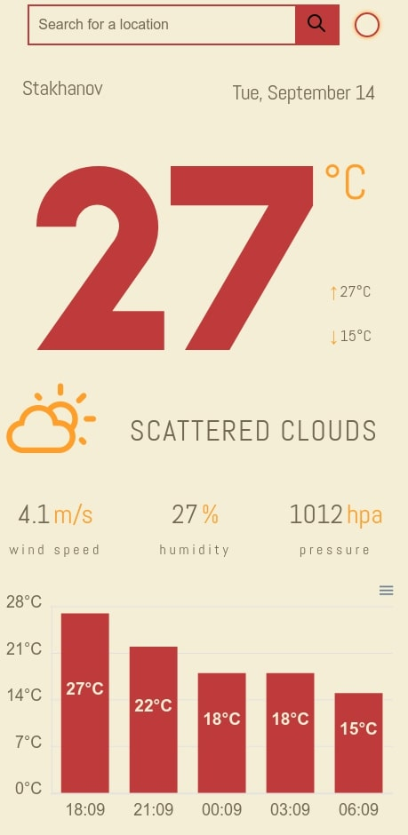
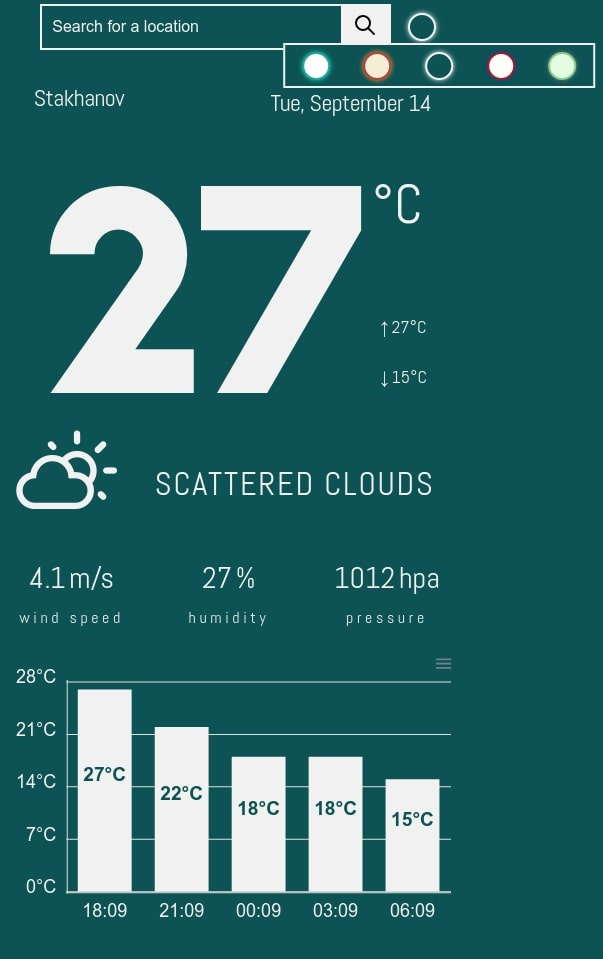

# React Weather App


A simple weather app that allows you to get current weather information, based on the city you are.
You can change the theme of the application by clicking on the circle near the search bar and select an available theme


## Installation

```sh
git clone git@github.com:Bukovski/react-weather-app.git
cd react-weather-app
npm install
npm run start
```

## .env.local

- REACT_APP_OPENWEATHERMAP_API_KEY - your personal key from [openweathermap api_keys](https://home.openweathermap.org/api_keys)
- REACT_APP_IPINFO_API_KEY - your personal key from [ipinfo](https://ipinfo.io/account/home)
- REACT_APP_STORAGE_NAME_THEME_COLOR - store the key for the skin color in localStorage


## Use Api

- get weather data from [openweathermap](https://openweathermap.org/)
- get user location data from [ipinfo.io](https://ipinfo.io/)


## Use Libs

- Font icons and CSS [weather-icons](https://erikflowers.github.io/weather-icons/)
- Diagram  [apexcharts.com](https://apexcharts.com/), [react-apexcharts](https://github.com/apexcharts/react-apexcharts)
- Change data format with [momentjs](https://momentjs.com/)
-  Publish files on GitHub [gh-pages](https://github.com/tschaub/gh-pages)
-  Pop-up messages on the page. Used to show errors [vercel-toast](https://vercel-toast.vercel.app/)
-  A simple animated number for React [animated-number-react](https://github.com/Leocardoso94/animated-number-react)



